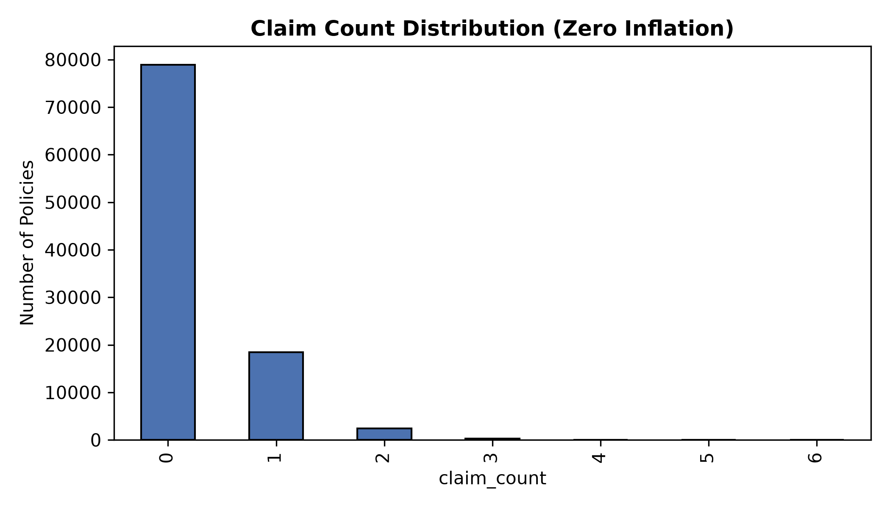
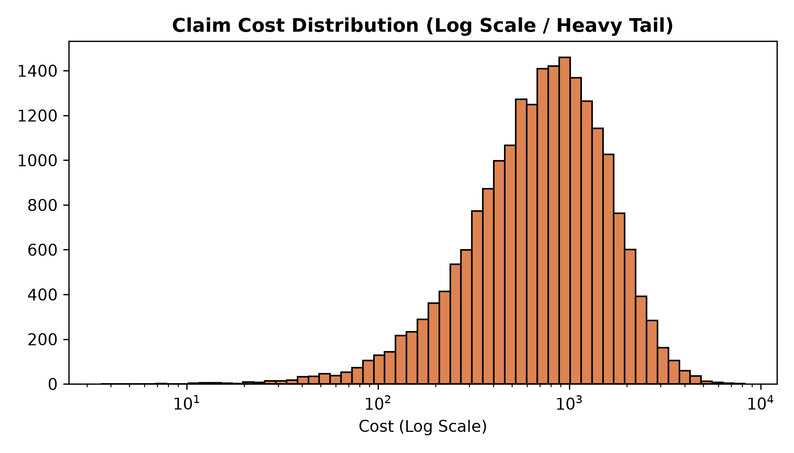
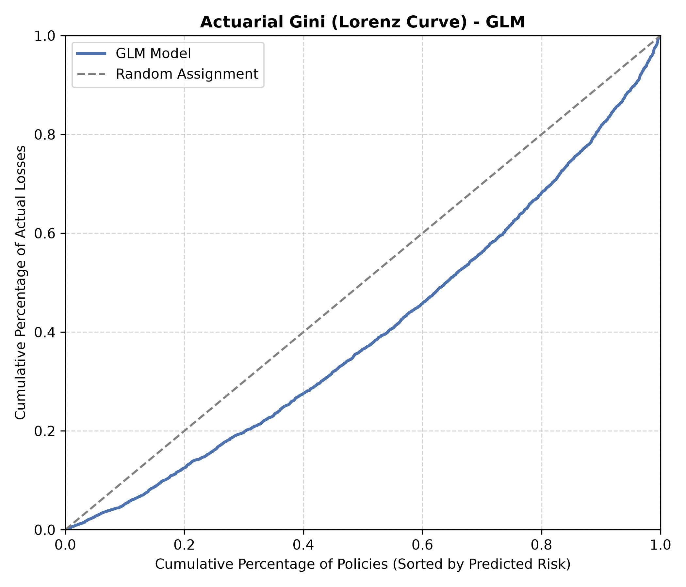
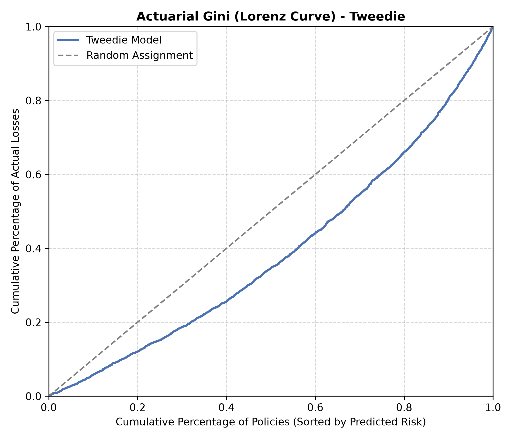
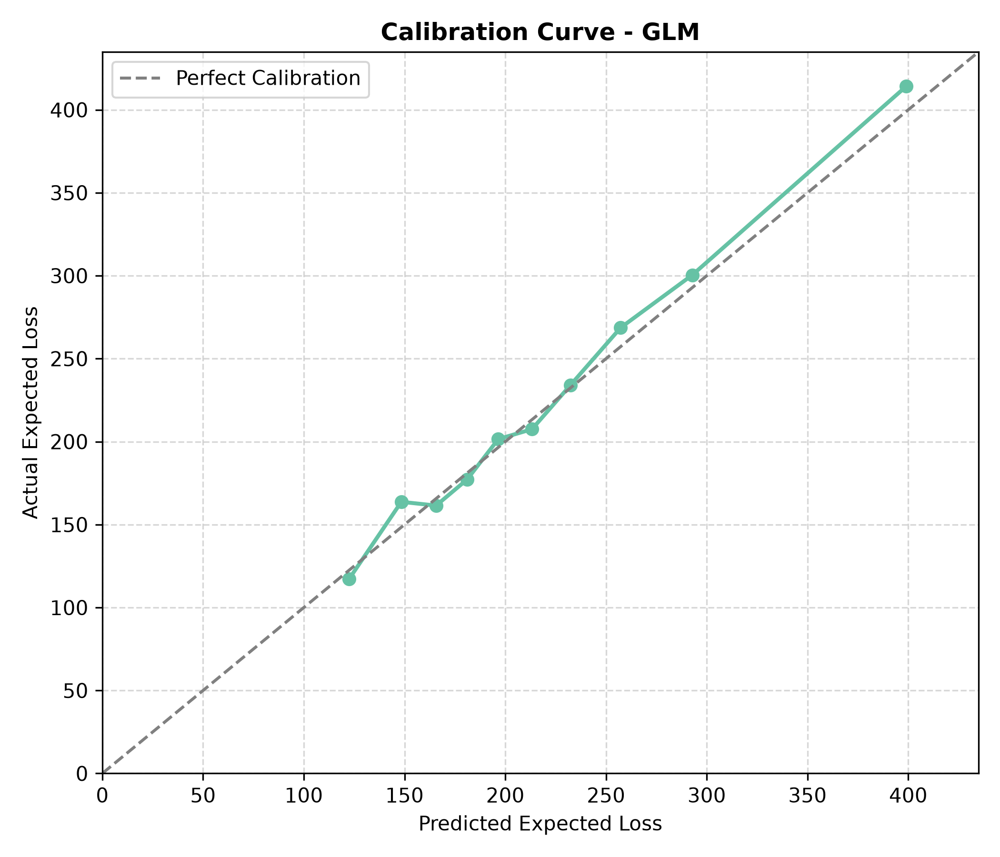
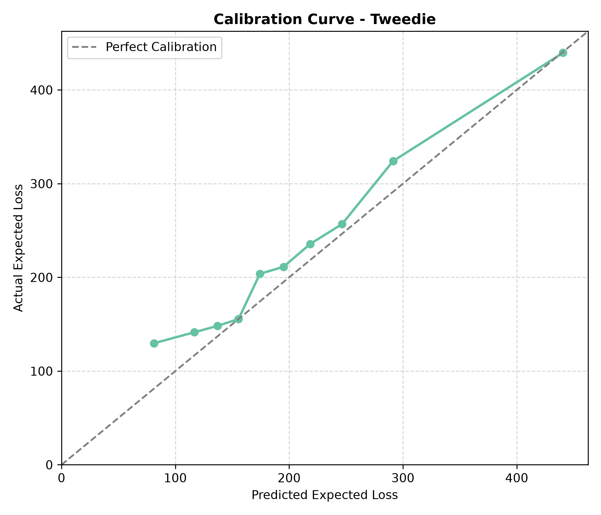
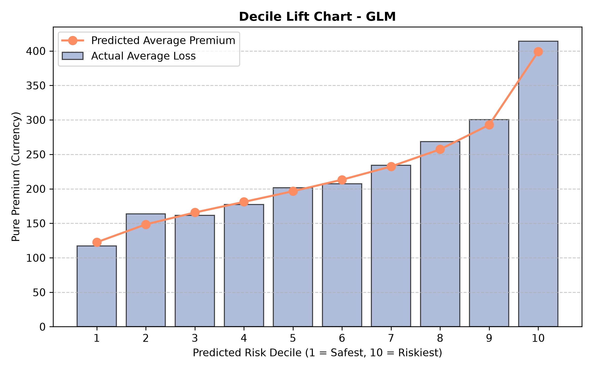
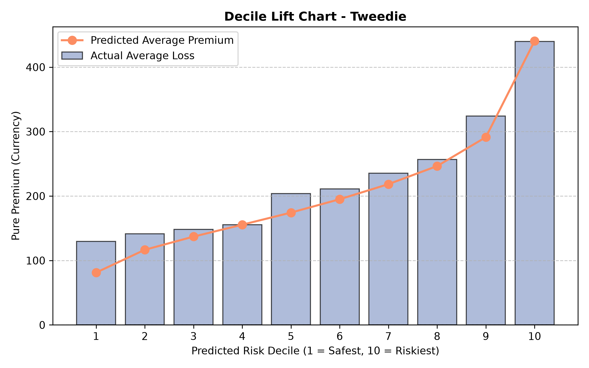
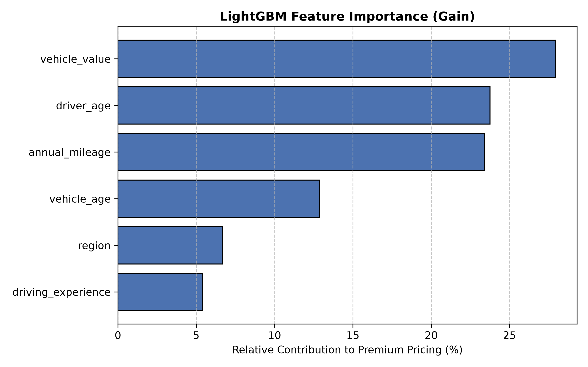
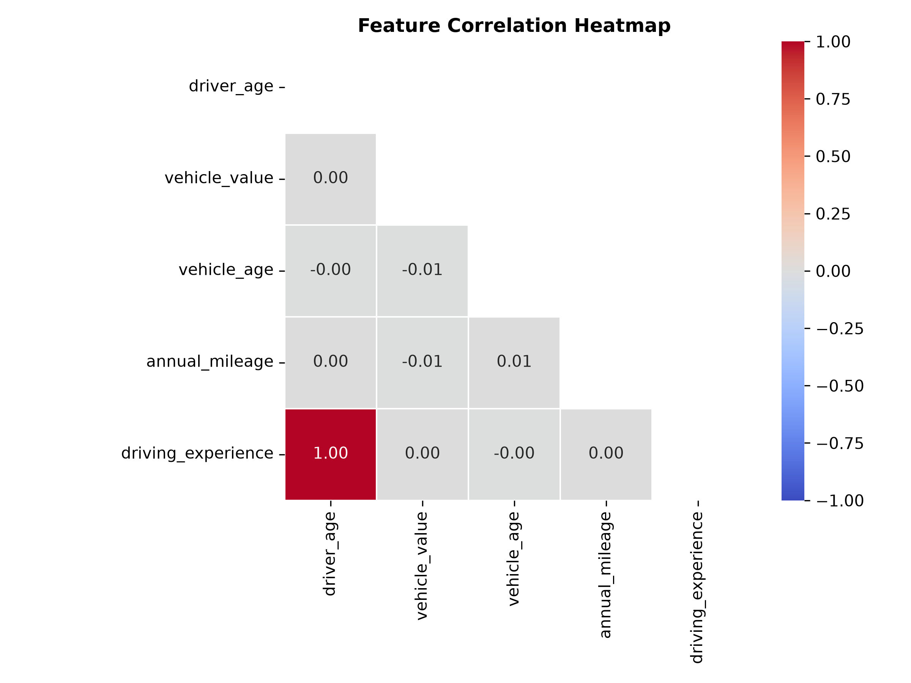

# Quantitative Insurance Pricing Engine  
### Actuarial GLM vs Gradient-Boosted Tweedie — A Risk Pricing Benchmark  


> A reproducible quantitative research prototype comparing a classical **Poisson-Gamma Generalized Linear Model (GLM)** with a **LightGBM model trained under Tweedie loss** on a synthetic motor insurance portfolio of 100,000 policies.

---

## 1. Executive Summary

This project simulates an insurance portfolio with a known, non-linear risk structure (e.g., a U-shaped driver age risk curve, regional loadings) and evaluates two pricing frameworks under identical, out-of-sample conditions. 

| Model | Actuarial Gini (Ranking Power) | Calibration Error WMAPE (Pricing Accuracy) |
| :--- | :--- | :--- |
| **Poisson-Gamma GLM** | 0.2249 | **3.50%** |
| **LightGBM (Tweedie)** | **0.2499** | 10.62% |

**The Core Insight:** Machine learning (LightGBM) excels at *risk discrimination* (ranking policies correctly), while traditional statistics (GLM) excels at *pricing stability and absolute calibration*. 

---

## 2. The Mathematical Problem

Pure premium (the expected loss cost per policy) is the product of two distinct processes:

$$\mathbb{E}[\text{Pure Premium}] = \mathbb{E}[\text{Claim Frequency}] \times \mathbb{E}[\text{Claim Severity}]$$

Modeling this presents three distinct quantitative hurdles:
1. **Zero Inflation:** The vast majority of policies generate exactly $0 in claims.
2. **Heavy Tails:** Rare claims generate massive, heavily skewed losses.
3. **Non-Linearity:** Underlying risk factors (like age) do not scale linearly.

<p align="center">
  
  
</p>

---

## 3. Methodology

### Synthetic Data Engine
Generates 100,000 policies with hidden ground-truth risk dynamics. Frequency is modeled via a Poisson process with a non-linear $\lambda$, and severity is modeled via Gamma-distributed losses scaled by vehicle value.

### Actuarial Baseline (Two-Stage GLM)
A classical statistical pipeline:
* **Poisson GLM:** Models claim frequency.
* **Gamma GLM:** Models claim severity (conditional on claims > 0).
* **Output:** $\text{Pure Premium} = \hat{\lambda} \times \hat{\mu}$

### Machine Learning Challenger (LightGBM)
A single-stage gradient boosting model utilizing **Tweedie regression** ($1 < p < 2$). By setting the variance power parameter to $p = 1.5$, Tweedie bridges frequency and severity into a unified mathematical framework, capturing non-linear risk surfaces natively.

---

## 4. Results & Evaluation

### Risk Discrimination (LightGBM Wins)
LightGBM outperforms the GLM in ranking high-risk policies. Its tree architecture naturally partitions the non-linear, U-shaped age-risk curve and learns complex interaction effects without manual feature engineering, resulting in a visibly superior Actuarial Gini coefficient (larger area between the model curve and the random assignment line).

<p align="center">
  
  
</p>

### Pricing Accuracy & Calibration (GLM Wins)
The traditional GLM delivers vastly superior calibration. Its rigid structural constraints enforce smooth predictions and anchor the model tightly to population-level statistics (hugging the diagonal). LightGBM is highly sensitive to extreme tail events, causing it to structurally misprice absolute currency amounts at the edges of the risk pool.

<p align="center">
  
  
</p>

### Business Value (Decile Lift Analysis)
Both models successfully identify risk cohorts, proving business utility. Notice how the predicted premium perfectly tracks the actual losses in the GLM, whereas LightGBM shows minor predictive deviation in the highest risk deciles.

<p align="center">
  
  
</p>

### Model Diagnostics & Sanity Checks
LightGBM successfully reverse-engineered the hidden dynamics of the synthetic simulator, accurately identifying `vehicle_value` and `driver_age` as the dominant drivers of expected loss.

<p align="center">
  
  
</p>

---

## 5. The Enterprise Architecture

This prototype demonstrates that neither model is sufficient alone for production-grade pricing. The recommended deployment architecture is a **hybrid system**:
1. Leverage **LightGBM** to capture complex, non-linear risk signals.
2. Feed those outputs into a **GLM recalibration layer** (or apply Isotonic/Platt Scaling) to enforce regulatory-aligned calibration and stable premium outputs.

---

## 6. Quickstart Execution

```bash
# 1. Install dependencies
pip install -r requirements.txt

# 2. Execute the end-to-end orchestration pipeline
python -m main

# 3. Verify mathematical metric integrity
pytest tests/
